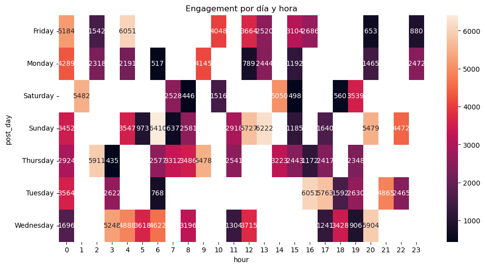

# Social Media Engagement Analysis

## Project Overview

This project analyzes engagement patterns across social media platforms to identify optimal content strategies.

The analysis focuses on:

* Post type performance
* Platform differences
* Posting time optimization

---

## Dataset

The dataset contains **101 social media posts** across:

* Facebook
* Instagram
* Twitter

### Features

* post_type
* platform
* post_time
* likes
* comments
* shares
* sentiment_score
* engagement (calculated)

---

## Key Insights

### 1. Interactive content performs best

Polls generate the highest average engagement.

### 2. Instagram favors visual content

Videos and images perform significantly better.

### 3. Best posting days

Friday and Sunday show the highest engagement levels.

---

## Visualization Example

---

## Tools Used

* Python
* Pandas
* Matplotlib
* Seaborn
* Jupyter Notebook

---

## Business Recommendations

* Use polls on Facebook to increase interaction.
* Prioritize video content on Instagram.
* Focus posting schedule on weekends.

---

## Author

Diego Plaza
